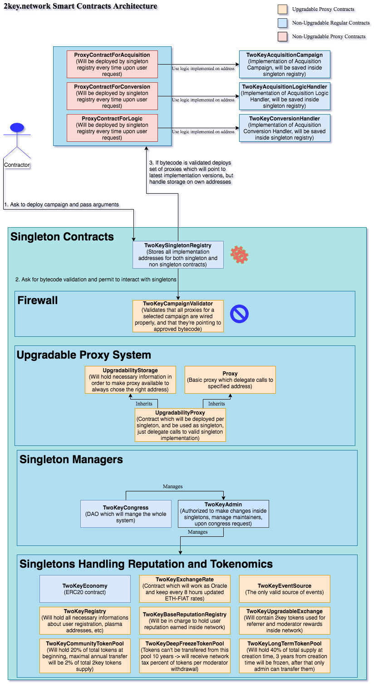

# 2key.network 

### 2key.network Smart-Contracts architecture

In order to accomplish initial idea, and create a network which handle properly user reputation,
security of assets and other information, while balancing to handle UX on the other side, which was
very challenging task, 2key.network operates with over 30 Smart-Contracts.

There are 2 types of contracts:

* Contracts deployed by 2key  (Singleton contracts)
* Contracts deployed by contractors (Non-Singleton contracts - Campaigns)

##### Singleton contracts

Singleton contracts are in charge to handle all necessary reputation logic, user information, and tokenomics,
which by itself required very sensitive security layer to even interact with them with Non-Singleton contracts.

Almost all singleton contracts are upgradable except Token contract, using Proxy pattern implemented based on the
OZ proposal for upgradable contracts. Which gave us pros such as continuously upgrading the logic of our contracts
and expanding storage as ideas are coming out, but again, we don’t have any power to affect any user funds, which will
keep security on the highest level. 

##### Non-Singleton contracts - Campaigns

Campaign contracts are deployed by users, which forces us to add a firewall contract between our singleton contracts
and Campaigns, in order to make sure Campaign is satisfying required criteria, and user didn’t deploy malicious contract.

 
Since we wanted to have full accounting on the contract side, with auth verification for even almost all getters, 
there was a need to use a couple of contracts to handle Campaign logic, so, to save a gas user have to pay, 
and make starting campaign process lightweight, so we decided to deploy only Proxies, which will be owned by contractors, 
and redirect all calls to Campaign Logic, but will have their own storage.

