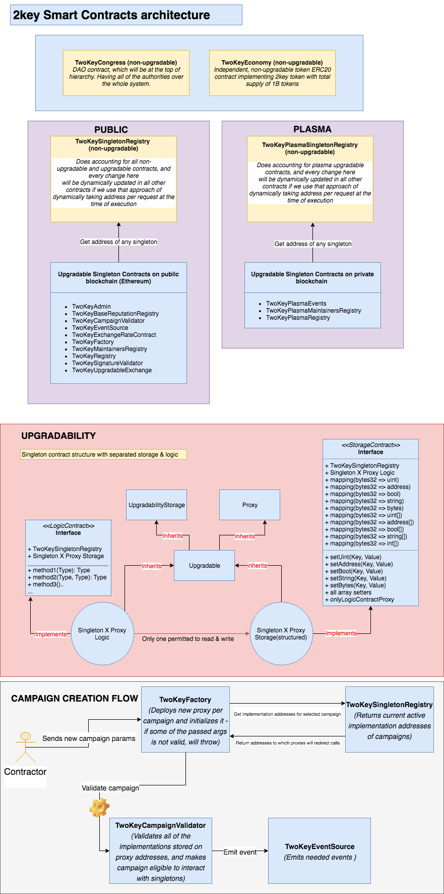

## 2key.network 

### 2key.network Smart-Contracts architecture

[Official Smart-Contracts documentation](https://2key.github.io/contracts) is generated automatically based on description annotation
above all methods & contract implementations by [Solidity-docgen](https://github.com/OpenZeppelin/solidity-docgen) 
and website generated based on the output of Solidity-docgen using [Docosaurus](https://github.com/facebook/Docusaurus)

In order to accomplish initial idea, and create a network which handle properly user reputation,
security of assets and other information, while balancing to handle UX on the other side, which was
very challenging task, 2key.network operates with over 30 Smart-Contracts and interfaces.

All contracts can be found [here](contracts)

There are 2 types of contracts:

* Contracts deployed by 2key  ([Singleton contracts](contracts/2key/singleton-contracts)) 
* Contracts deployed by contractors ([Non-Singleton contracts - Campaigns](contracts/2key/acquisition-campaign-contracts))

##### Singleton contracts

Singleton contracts are in charge to handle all necessary reputation logic, user information, and tokenomics,
which by itself required very sensitive security layer to even interact with them with Non-Singleton contracts.

Almost all singleton contracts are upgradable except Token contract, using Proxy pattern with Eternal storage.
Which gave us pros such as continuously upgrading the logic of our contracts, and expanding storage as ideas are coming out, but again, we don’t have any power to affect any user funds, which will
keep security on the highest level. 

##### (1) TwoKeyCongress (NON-UPGRADABLE)
Contract which is on the top of the hierarchy, DAO, which has supremacy over all system, and upon voting for specific proposal, if the
quorum is reached, can modify almost everything. All manipulations of other singletons from congress will go through TwoKeyAdmin contract.

##### (2) TwoKeyAdminContract (UPGRADABLE)
Contract which is in charge to execute specific operations per congress request.

##### (3) TwoKeyEconomy (NON-UPGRADABLE)
Contract which is implementation of regular ERC20, with a minor modification. Our TwoKeyEconomy will have ability to freeze all transfers
per request of the token. Mints 1B 2KEY tokens, which will be used as a fuel for our system to work, distribute rewards, etc.

##### (4) TwoKeyBaseReputationRegistry (UPGRADABLE)
Contract which will handle accounting of reputation points, depending on number of executed and rejected conversions, campaigns, etc.

##### (5) TwoKeyCampaignValidator (UPGRADABLE)
Contract which is in charge to store addresses of all valid campaigns. Every time campaign is created via TwoKeyFactory, it will call this contract and make 
fresh created campaign valid to interact with other singletons. It's some kind of Firewall.

##### (6) TwoKeyEventSource (UPGRADABLE)
Contract which is going to be a single place from which will be all events emitted. 

##### (7) TwoKeyExchangeRateContract (UPGRADABLE)
Contract which will handle exchange rates between FIAT currencies, between FIAT - CRYPTO and will be maintained by approved maintainers stored in TwoKeyMaintainersRegistry

##### (8) TwoKeyFactory (UPGRADABLE) 
Contract which will be in charge of deployment of Proxies for all types of campaign. Once it deploys proxy, it will initialize campaigns
(call setInitialParams methods -> replacement for constructor) and validate campaign through TwoKeyCampaignValidator + call TwoKeyEventSource
to emit "created" event. 

##### (9) TwoKeyMaintainersRegistry (UPGRADABLE)
Contract which will store all the maintianers eligible to modify some stuff around singletons. In general, the most important function
it exports is getter if user is maintainer.

##### (10) TwoKeyRegistry (UPGRADABLE)
Contract which will store user information, such as handle, wallet name, etc.

##### (11) TwoKeySignatureValidator (UPGRADABLE)
Contract which will be in charge to valiadate specific signatures per request

##### (12) TwoKeySingletonRegistry (UPGRADABLE)
Contract which is working as accountant for all versions of other upgradable contracts + the only one eligible to upgrade specific singleton contract per deployer request 

##### (13) TwoKeyUpgradableExchange (UPGRADABLE)
Contract which be in charge mostly for supporting rewards payment, also, handle exchanges to stable coin (hedging), etc.

##### (14) TwoKeyPlasmaSingletonRegistry (NON-UPGRADABLE)
Contract which is working as accountant for all versions of other upgradable contracts on plasma network + the only one eligible to upgrade specific singleton contract per deployer request 

##### (15) TwoKeyPlasmaEvents (UPGRADABLE)
Contract which will handle joins on plasma + emit needed events

##### (16) TwoKeyPlasmaMaintainersRegistry (UPGRADABLE)
Contract which will store all the maintainers on plasma eligible to modify some stuff around singletons. In general, the most important function
it exports is getter if user is maintainer.

##### (17) TwoKeyPlasmaRegistry (UPGRADABLE)
Contract which work same as TwoKeyRegistry just on plasma network.
  

##### Non-Singleton contracts - Campaigns

Campaign contracts are deployed by users, which forces us to add a firewall contract between our singleton contracts
and Campaigns, in order to make sure Campaign is satisfying required criteria, and user didn’t deploy malicious contract.

 
Since we wanted to have full accounting on the contract side, with auth verification for even almost all getters, 
there was a need to use a couple of contracts to handle Campaign logic, so, to save a gas user have to pay, 
and make starting campaign process lightweight, so we decided to deploy only Proxies through TwoKeyFactory contract, which will be owned by contractors, 
and redirect all calls to Campaign Logic, but will have their own storage.

For development instructions, and how to run contracts locally, check [Setup dev-environment instructions](readmes/SetupDevEnv.md)

